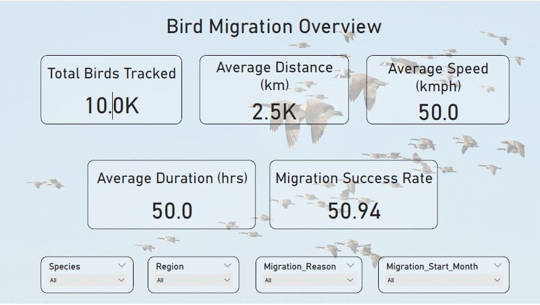
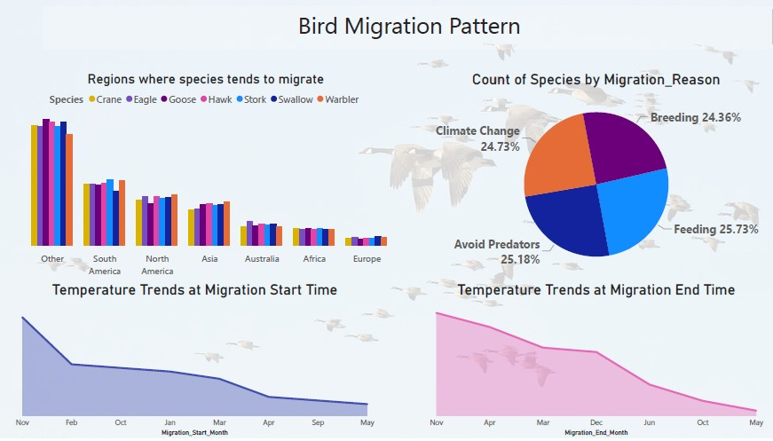
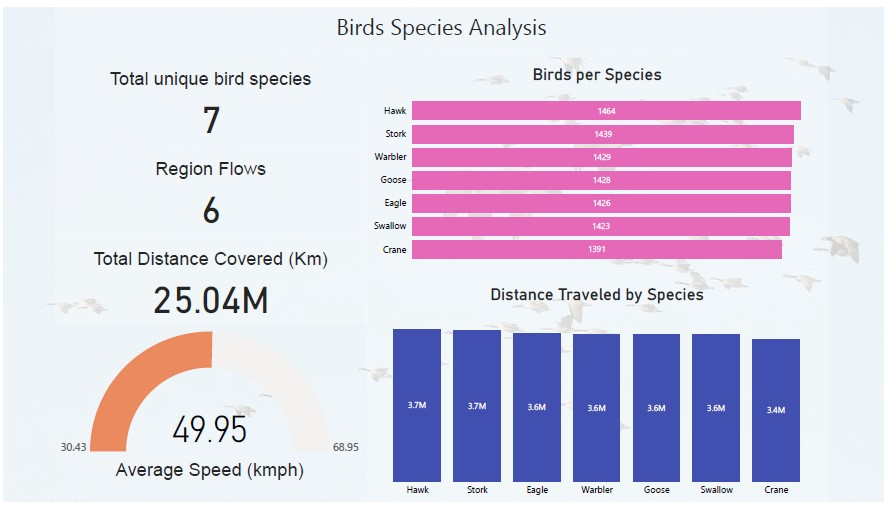
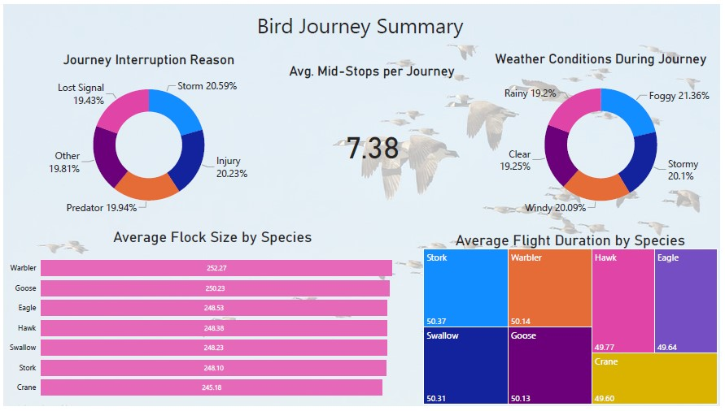

# 🐦 Bird Migration Analysis | Power BI Dashboard Project

This Power BI project explores bird migration patterns using real-world data across continents, species, and weather conditions. The goal was to uncover behavioral insights and environmental impacts influencing bird journeys.

---

## 📌 Project Goal

To visualize and extract actionable insights from bird migration data, including speed, flock behavior, geography, weather conditions, and journey interruptions to support ecological and conservation research.

---

## 📊 Key Dashboard Insights

- Total birds tracked: **10,000**
- Total distance covered: **25 million km**
- Average speed: **50 kmph**
- Migration success rate: **50.94%**
- Most common migration reasons: **Feeding (25.73%)**, **Breeding (24.36%)**
- Common journey interruptions: **Storms (20.59%)**, **Predators (20.23%)**
- Top migrating species: **Hawk**, **Stork**, **Warbler**

---

## 📷 Dashboard Snapshots

### 📌 Bird Migration Overview

### 📌 Migration Patterns & Trends

### 📌 Species-wise Analysis

### 📌 Journey Summary

---

## 🧠 Tools & Technologies Used

- **Power BI**: For dashboard creation and data storytelling  
- **CSV Dataset**: Raw bird tracking data (provided)  
- **Data Cleaning & Modeling**: Using Power BI’s DAX and transformations

---

## 📁 Project Structure

- `Bird_Migration_Analysis.pbix` → Power BI report file  
- `Bird_Migration_Analysis.pdf` → Printable dashboard export  
- `bird_migration_data.csv` → Source dataset  
- `Screenshots/` → Dashboard image exports (for GitHub README)

---

## ✅ Outcomes

- Identified vulnerable bird species and high-risk migration routes  
- Mapped weather patterns impacting migration success  
- Helped simulate real-world ecological research using data visualization  
- Created an interactive dashboard usable by researchers, NGOs, and planners

---

